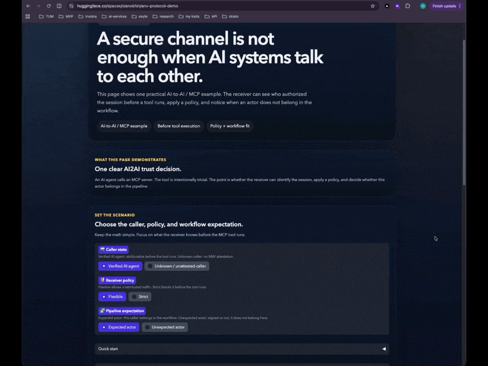

# ANV: Authorizing Nature Verification Protocol


[](https://opensource.org/licenses/Apache-2.0)
[]()
[](https://olanokhin.com)

> *TLS secured the channel. ANV identifies who authorized it.*

---

## Observation

Emerging agentic communication systems — operating across independent
implementations, vendors, and protocol stacks — independently exhibit
a common requirement: recipients need to determine the type of
authorizing party before or during interaction, not solely from content.

Existing transport and session protocols (TLS 1.3, QUIC, MLS, WebRTC)
verify that data reached the correct endpoint securely. They do not
semantically encode the authorization type of the communicating party
at the session layer.

This produces four communication states:

```
H2H    human  -> human    no mutual authorization attestation standard
H2AI   human  -> AI       FIDO2 covers human side; AI side unattested
AI2H   AI     -> human    no standard exists at session layer
AI2AI  AI     -> AI       no attestation standard
```

Existing authentication mechanisms — mTLS, OAuth 2.1, SPIFFE/SPIRE,
signed agent cards — establish workload identity and permission scope.
They do not semantically encode whether the authorizing party is a
human principal or an AI provider instance at the session layer.
This distinction is documented as an open problem in the MCP and A2A
security specifications.

This document formalizes the minimal mechanism required to address
this class of problems across independent agentic systems.

This problem was previously theoretical. It becomes practical with
the emergence of agentic systems capable of autonomously initiating
real-time interactions at scale. MCP and A2A are early instances of
a broader class of protocols that expose this gap operationally.
The window for establishing a neutral, composable standard at the
transport layer is now open.

---

## Non-Goals

ANV explicitly does not:
- Replace existing identity systems (mTLS, SPIFFE, OAuth 2.1, FIDO2)
- Verify content authorship or per-message origin
- Attest to internal AI implementation details
- Provide trust scoring or behavioral guarantees
- Classify biological nature of participants
- Guarantee continuous presence of authorizing party
- Prevent relay attacks within authorized sessions
- Prove provider identity beyond organizational certificate level

**ANV cryptographically guarantees:**
- Which attestation class authorized the session
- That a hardware-bound credential authorized session initiation
- Organizational-level identity of the authorizing party

**ANV does NOT cryptographically guarantee:**
- Continuous presence of the authorizing party after initiation
- Per-message content authorship
- Prevention of SIGNED_HUMAN relaying AI-generated content

For per-message content authorship, use C2PA in conjunction with ANV.
ANV and C2PA are complementary and composable.

---

## Approach

ANV proposes a transport-layer extension that semantically encodes
the authorization type of a communication session.

Three states representing minimal initial classifications:

```
SIGNED_HUMAN    human-controlled credential + device attestation
                (FIDO2 + Secure Enclave)
                Does not prove continuous human presence —
                attests that a human-controlled credential
                authorized the session
SIGNED_AI       hardware-bound provider attestation
                (TPM / Confidential Computing)
UNSIGNED        no ANV data — legacy fallback
                ANV introduces no negative trust signal;
                UNSIGNED means absence of proof, not presence of risk
```

The model is designed for extension and policy layering above the
protocol level. These three states are the minimal required set,
not an exhaustive taxonomy.

The attestable unit for AI providers is the service endpoint on
attested hardware infrastructure — not the underlying model
implementation. This is analogous to TLS attesting server identity
without attesting application behavior.

ANV encodes authorization type through organizational certificate
binding. The authorizing party is identified at the organizational
level, not at the individual entity level. The protocol establishes
accountability, not surveillance.

UNSIGNED does not mean fraudulent. It means unattested.

---

## Applicability Criteria

ANV is applicable to a protocol when all three conditions are
satisfied simultaneously:

```
1. Real-time bidirectional channel
2. Recipient can act on authorization information before or during interaction
3. The type of authorizing party is material to the recipient's decision
```

---

## Threat Model

ANV addresses three documented classes of threat:

**AI impersonation of human principal**
An AI agent presents itself as a human in a real-time channel without
cryptographic disclosure. Recipients cannot distinguish this without
content analysis. ANV makes the distinction available at session
initiation before content is received.

**Undisclosed AI interaction**
A human recipient engages with an AI agent without knowledge of its
provider identity. No existing transport-layer standard requires
cryptographic disclosure. ANV provides provider identity before
content delivery.

**Rogue agent injection in pipeline**
An unaffiliated AI agent is injected into a multi-agent pipeline.
Certificate issuer mismatch or UNSIGNED state is detectable at the
point of injection without content analysis.

---

## Applicability to Agentic Protocols

MCP and A2A are current instances of a broader class of agentic
protocols that independently exhibit the same session-layer gap.
ANV is not specific to either protocol.

**MCP:** OAuth 2.1 and PKCE establish token integrity. They do not
prove which AI provider instance initiated the request at the hardware
level. ANV addresses this as a TLS extension beneath MCP.
No MCP protocol changes required.

**A2A:** Signed agent cards (v0.3) establish card content integrity.
ANV adds hardware-bound provider attestation at the session layer,
complementing rather than replacing signed cards.
No A2A protocol changes required.

Any agentic protocol operating over TLS and satisfying the applicability
criteria can adopt ANV without changes to the agentic protocol itself.

---

## Applicability Matrix

**H2H — Mutual Authorization Attestation**
Both parties present SIGNED_HUMAN credentials. Certificate issuer
identifies organizational affiliation. Applicable to legally and
financially significant communications requiring session-layer audit trail.

**H2AI — Verified AI Provider Identity**
Human verifies AI provider certificate against known issuer before
engaging. Certificate issuer mismatch detectable without content
analysis. Complements FIDO2: ANV adds AI-side attestation.

**AI2H — Disclosed AI Initiation**
AI provider identity cryptographically available to recipient before
content delivery. No existing transport-layer standard addresses this.
Primary gap ANV targets. Applicable to AI-operated services subject
to EU AI Act Article 52 disclosure requirements.

**AI2AI — Agent Pipeline Attestation**
Verifiable authorization chain across each hop. Rogue agent injection
detectable at point of entry without content analysis. Applicable to
MCP tool call chains and A2A task delegation pipelines.

**UNSIGNED — Legacy Compatibility**
Existing traffic continues to function. Recipients determine own policy.

---

## Out of Scope

**Asynchronous delivery** (Email, RSS, webhooks): criterion 2 not
satisfied. C2PA, DKIM, S/MIME address these cases.

**Non-bidirectional sessions** (DNS, NTP, CDN): criterion 1 not satisfied.

**Content signing** (code signing, package registries, Git): criterion 3
not applicable in ANV sense. Existing standards apply.

---

## Relation to Existing Standards

| Standard | Function | Relation to ANV |
|---|---|---|
| TLS 1.3 | Server certificate verification | ANV adds session-layer authorization type encoding |
| mTLS | Mutual certificate authentication | Establishes workload identity; does not encode human vs AI type |
| FIDO2 | Human-device binding | Human side only; ANV adds AI-side and session-level type |
| SPIFFE/SPIRE | Workload identity (cloud/K8s) | Infrastructure identity; no human/AI semantic distinction |
| OAuth 2.1 | Authorization scope and token integrity | Permission layer; ANV is attestation layer below |
| RATS/EAT [RFC9528] | Remote attestation procedures | ANV attestation_payload uses EAT format; RATS is the verification layer |
| RFC 9421 | HTTP Message Signatures | HTTP-layer signing; ANV operates at TLS session layer |
| MCP auth spec | Token-based MCP authorization | Hardware-level provider attestation open; ANV addresses this |
| A2A agent cards | Agent capability declaration | Card integrity (v0.3); ANV adds session-layer hardware attestation |
| C2PA | Content signing post-creation | Asynchronous; out of ANV scope |
| CT logs | Certificate audit trail | Proposed as ANV attestation registry model |

ANV is composable with all of the above:
TLS+ANV, MCP+ANV, A2A+ANV, FIDO2+ANV, SPIFFE+ANV.

---

## Trust Model

ANV inherits the PKI trust model [RFC5280]. The protocol provides
cryptographic proof of authorization type at the session layer.
Trust in the authorizing party is a reputational and legal concern
outside protocol scope — consistent with TLS and FIDO2.

CA accountability for misissuance applies on the same basis as in
existing PKI deployments. An authorized session produces a forensic
audit trail: the authorizing party is cryptographically identifiable
at the organizational level from session records.

---

## Attestation Payload Format

ANV attestation_payload uses Entity Attestation Token (EAT) format
[RFC9528], consistent with IETF RATS (Remote ATtestation procedureS)
architecture. Hardware-specific verification (SGX, SEV, TDX, TrustZone)
is delegated to RATS Verifier services, abstracting hardware diversity
from the ANV session layer. Receiving parties verify the EAT token
from a RATS Verifier, not raw hardware attestation evidence directly.

This approach reuses existing RATS infrastructure and avoids
requiring per-hardware verification logic at every ANV endpoint.

---

## Deployment

No new hardware infrastructure required. AI providers on existing
TEE-capable infrastructure (Intel TXT, AMD SEV, ARM TrustZone)
implement ANV without hardware changes.

Existing Certificate Authorities extend to issue AI provider endpoint
certificates using existing organizational validation processes.
Certificate Transparency log infrastructure [RFC6962] provides the
audit trail for provider attestations.

Adoption is voluntary. UNSIGNED remains valid for legacy compatibility.

---

## Known Open Problems

1. **Attestation registry governance** — CT-log-style decentralization
   proposed; governance model to be defined in working group.

2. **Continuous liveness** — Phase 1 attests at session initiation only.
   Per-stream re-attestation proposed as optional extension.

3. **TLS middlebox ossification** — corporate proxies may drop unknown
   TLS extension types on port 443. Deployment mitigations to be
   addressed in draft-01.

4. **Attestation privacy** — EAT payloads may reveal organizational and
   infrastructure metadata to recipients. Privacy-preserving attestation
   options (selective disclosure, ZK proofs) to be explored in future
   drafts.

5. **Physical coercion** — outside protocol scope; consistent with FIDO2.

---

## Roadmap

```
PoC Stage 1 — MCP (Q2 2026)
  TLS ANV extension, vendor-neutral mock attestation
  Single AI provider → single MCP server
  Demonstrate: provider type visible before first tool call
  Measure: Phase 1 latency overhead
  Artifact: open source implementation + benchmark

PoC Stage 2 — A2A (Q2 2026)
  Same TLS extension applied to A2A HTTPS transport
  Broken chain detection across agent hops
  Artifact: cross-protocol demo

MVP (Q3 2026)
  One CA issues real AI provider endpoint certificate
  IETF draft-01: wire format + KDF + EAT attestation_payload spec
  Community outreach: MCP, A2A, IETF RATS WG, IETF WIMSE WG, IRTF

Product v1 (2027)
  CA/Browser Forum AI provider cert profile adopted
  MLS+ANV, MCP+ANV, A2A+ANV extensions ratified
  Browser ANV indicator

Standardization (2027+)
  IANA assignments
  httpsa:// and wssa:// URI scheme registration
  RFC publication

Regulatory (parallel with Product v1)
  EU AI Act Article 52 candidate mechanism
  Reference implementation for regulators
```

---

**Author:** Alex Anokhin
**Contact:** olanokhin@gmail.com
**GitHub:** github.com/olanokhin/anv-protocol
**Date:** April 2026
